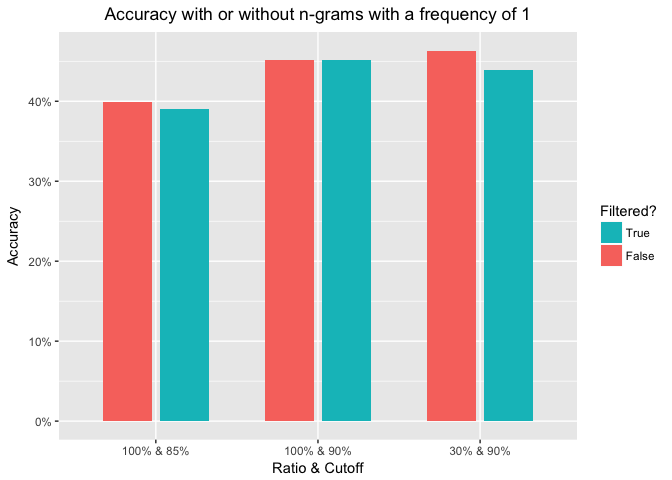
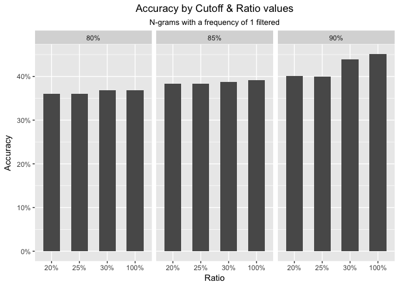
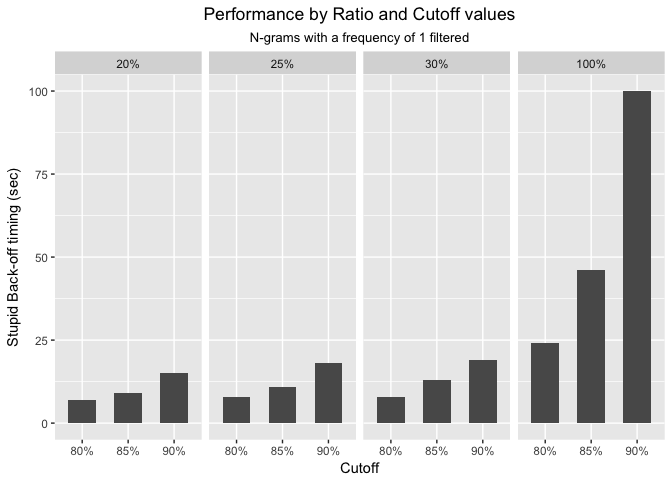
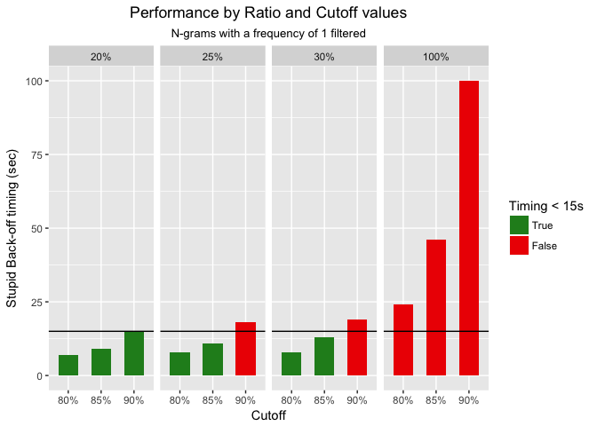
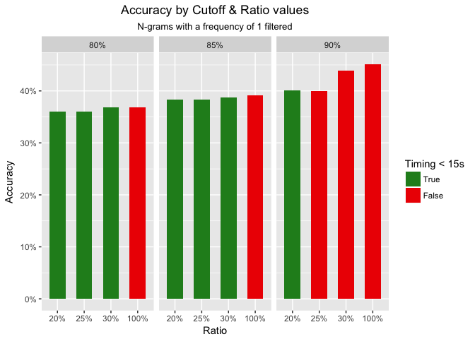

Background
----------

Around the world, people are spending an increasing amount of time on
their mobile devices for email, social networking, banking and a whole
range of other activities. But typing on mobile devices can be a serious
pain. SwiftKey, the corporate partner in this capstone, builds a smart
keyboard that makes it easier for people to type on their mobile
devices. One cornerstone of their smart keyboard is predictive text
models. When someone types:

    I went to the

the keyboard presents three options for what the next word might be. For
example, the three words might be gym, store, restaurant.

Objective
---------

The objective of this project is to put in practice all knowledge
acquired during the previous 9 courses from the Data Science
Specialization.  
The project will consist in showcasing in a shinyApp a predictive model
of the next word someone is typing on a keyboard.

A secondary objective will be do it in a reproductible way.

Data retrieval and cleaning
---------------------------

### Data retrieval

The data is from a corpus called HC Corpora
([http://www.corpora.heliohost.org](https://web.archive.org/web/20160522150305/http://www.corpora.heliohost.org/aboutcorpus.html)).

The following directories are available once the archive has been
unzipped:

-   final:
    -   de\_DE
    -   en\_US
    -   fi\_FI
    -   ru\_RU

Each language specific sub-folder contains three files:

-   \[**locale**\].blogs.txt
-   \[**locale**\].news.txt
-   \[**locale**\].twitter.txt

In this project, we will focus on the en\_US locale.

Some interesting facts on these files:

<table style="width:60%;">
<colgroup>
<col width="25%" />
<col width="16%" />
<col width="18%" />
</colgroup>
<thead>
<tr class="header">
<th align="right">file_name</th>
<th align="right">file_size</th>
<th align="right">nb_of_lines</th>
</tr>
</thead>
<tbody>
<tr class="odd">
<td align="right">en_US.twitter.txt</td>
<td align="right">159.4 Mb</td>
<td align="right">2,360,148</td>
</tr>
<tr class="even">
<td align="right">en_US.blogs.txt</td>
<td align="right">200.4 Mb</td>
<td align="right">899,288</td>
</tr>
<tr class="odd">
<td align="right">en_US.news.txt</td>
<td align="right">196.3 Mb</td>
<td align="right">1,010,242</td>
</tr>
</tbody>
</table>

### Splitting Corpus

The dataset is partitionned into a training (99%) and testing (1%) set
using a random binomial sampling via the `splitCorpus` function.

The training set will be used to created the Language Model: n-gram
tables.  
The testing set will be used to:

-   Optimize the Accuracy vs Performance tradeoff when tweaking the
    model
-   Calculate the Accuracy of the model

### Data cleaning

Some refinement is done on the data via the `cleaningCorpus` function:

-   URL, hashtag and mention filtering: These elements are too specific
    to the context they appear in.
-   Lowercase transforming: In order to simplify the problem, text is
    transformed in lowercase.
-   Removing non-ASCII characters
-   Removing profanities
-   Removing ponctuation but preserving intra words one
-   Removing extra whitespace

Other cleaning rules have been reviewed but not used:

-   Stemming words: as our application comprise a generation phase
    (prediction of the next word), it would have been necessary to add
    back what was removed from the stemming process which complexity was
    not worth the gain.
-   Foreign words: test of the `textcat` package showed very
    poor results. Therefore, I decided not to use it.

A future refinement would consists in splitting lines by sentences so
that one line only consists of one sentence.  
The implementation of such refinement will be challenging: There is no
special character to end a sentence!  
Furthermore, many exceptions apply:

-   It can be any of the following characters: ".", "!", "?".
-   The character can be used multiple times to accentuate its meaning:
    "!!!", "??", "...".
-   Multiple characters can be used in conjunction: "!!?", "??!".
-   It can be missing at the end of the sentence.

Another problem that would need to be tackled is the multiple purposes
of the "." character:

-   Abbreviate a word (e.g. St.)
-   After an initial letter used to stand for a name (e.g. J. K.
    Rowling)
-   Placed after each individual letter in an initialism (e.g. U.S.A.)
-   It has multiple contexts in mathematics and computing

Implementing such refinement should increase significantly the accuracy
of the model.

Language Model and Algorithms
-----------------------------

### Language Model

Our predictive model will rely on a Language Model which

> is a probability distribution over sequences of words. Given such a
> sequence, say of length *m*, it assigns a probability
> *P*(*w*1,…,*w**m*) to the whole sequence.  
> \[...\]  
> In speech recognition, the computer tries to match sounds with word
> sequences. The language model provides context to distinguish between
> words and phrases that sound similar. For example, in American
> English, the phrases "recognize speech" and "wreck a nice beach" are
> pronounced almost the same but mean very different things. These
> ambiguities are easier to resolve when evidence from the language
> model is incorporated with the pronunciation model and the acoustic
> model." \[[1](#language_model)\].

In our context, it will be used to assess the probability of the next
possible words and therefore identifying the most probable one.

> Data sparsity is a major problem in building language models. Most
> possible word sequences will not be observed in training. One solution
> is to make the assumption that the probability of a word only depends
> on the previous n words. \[[1](#language_model)\].

This assumption is also known as the nth order Markov
property\[[2](#markov_property)\].

It is built on the concept of Markov Process which consider a sequence
of random variables
*X*1,  *X*2,  ..., *X**m*.  
In our context, each word in the sentence is a random variable.  
Each random variable can take any value in a finite set *V*.  
We could rewrite our probability function as:
*P*(*X*1=*x*1, *X*2=*x*2, ..., *X**m*=*x**m*)

Thanks to the chain rule property of probabilities, we can rewrite our
Language Model probability function as:
$$P\\left(X\_{1} = x\_{1},\\,X\_{2} = x\_{2},\\,...,\\,X\_{m} = x\_{m}\\right) \\\\
= P\\left(X\_{1} = x\_{1}\\right) \\cdot P\\left(X\_{2} = x\_{2}\\, | \\,X\_{1} = x\_{1}\\right) \\\\
\\prod\\limits\_{i=3}^{m} P\\left(X\_{i} = x\_{i}\\, | \\,X\_{1} = x\_{1},\\,...,\\,X\_{i-1} = x\_{i-1}\\right) $$

Making the 2nd order Markov Assumption, we obtain:

$$= P\\left(X\_{1} = x\_{1}\\right) \\cdot P\\left(X\_{2} = x\_{2}\\, | \\,X\_{1} = x\_{1}\\right) \\\\
\\prod\\limits\_{i=3}^{m} P\\left(X\_{i} = x\_{i}\\, | \\,X\_{i-2} = x\_{i-2},\\,X\_{i-1} = x\_{i-1}\\right) $$

Each word probability now only depends on the two previous words. Our
Language Model is therefore a tri-gram model.

### Accounting for unobserved n-grams

Several techniques allows to account for unobserved n-grams including
Interpolation and Discount methods.  
I have decided to implement two methods:

-   Katz Back-off Model \[[3](#katz_bo_model)\]
-   Stupid Back-off Model \[[4](#stupid_bo_model)\]

#### Katz Back-off Model

The Katz Back-off Model is a discounting method which consists in
lowering probability of observed n-grams so that the left over
probability mass can be assigned to non-observed ones.

In practice, we will substract a constant amount *d* = 0.5 from n-gram
counts:
*C**o**u**n**t*\*(*w**i* − 2, *w**i* − 1, *w**i*) = *C**o**u**n**t*(*w**i* − 2, *w**i* − 1, *w**i*) − *d*
*C**o**u**n**t*\*(*w**i* − 1, *w**i*) = *C**o**u**n**t*(*w**i* − 1, *w**i*) − *d*

This model also uses back-off to n-grams with lower history
((n-1)-grams, (n-2)-grams, ... , 1-grams) in order to generate a more
accurate probability for non-observed n-grams.

For a trigram model, let's first define two sets:
*A*(*w**i* − 2, *w**i* − 1) = {*w*:*C**o**u**n**t*(*w**i* − 2, *w**i* − 1, *w*)&gt;0}
*B*(*w**i* − 2, *w**i* − 1) = {*w*:*C**o**u**n**t*(*w**i* − 2, *w**i* − 1, *w*)=0}
 The Katz Backed-Off (KBO) estimate is then defined as:
$$q\_{KBO}\\left(w\_{i}\\,|\\,w\_{i-2},\\,w\_{i-1}\\right) = \\left\\{
    \\begin{array}{ll}
        \\frac{Count^{\*}\\left(w\_{i-2},\\,w\_{i-1},\\,w\_{i}\\right)}{Count\\left(w\_{i-2},\\,w\_{i-1}\\right)}\\,\\,\\,if\\,\\,w\_{i} \\in A\\left(w\_{i-2},\\,w\_{i-1}\\right)\\\\
        \\frac{\\alpha\\left(w\_{i-2},\\,w\_{i-1}\\right)\\,q\_{KBO}\\left(w\_{i}\\,|\\,w\_{i-1}\\right)}{\\sum\_{w \\in B\\left(w\_{i-2},\\,w\_{i-1}\\right)} q\_{KBO}\\left(w\\,|\\,w\_{i-1}\\right)}\\,\\,\\,if\\,\\,w\_{i} \\in B\\left(w\_{i-2},\\,w\_{i-1}\\right)
    \\end{array}
\\right.$$
 where
$$\\alpha\\left(w\_{i-2},\\,w\_{i-1}\\right) = 1 - \\sum\_{w \\in A\\left(w\_{i-2},\\,w\_{i-1}\\right)} \\frac{Count^{\*}\\left(w\_{i-2},\\,w\_{i-1},\\,w\\right)}{Count\\left(w\_{i-2},\\,w\_{i-1}\\right)}$$

And now, for a bigram model, let's define two sets:
*A*(*w**i* − 1) = {*w*:*C**o**u**n**t*(*w**i* − 1, *w*)&gt;0}
*B*(*w**i* − 1) = {*w*:*C**o**u**n**t*(*w**i* − 1, *w*)=0}
 The Katz Backed-Off (KBO) estimate is then defined as:
$$q\_{KBO}\\left(w\_{i}\\,|\\,w\_{i-1}\\right) = \\left\\{
    \\begin{array}{ll}
        \\frac{Count^{\*}\\left(w\_{i-1},\\,w\_{i}\\right)}{Count\\left(w\_{i-1}\\right)}\\,\\,\\,if\\,\\,w\_{i} \\in A\\left(w\_{i-1}\\right)\\\\
        \\frac{\\alpha\\left(w\_{i-1}\\right)\\,q\_{ML}\\left(w\_{i}\\right)}{\\sum\_{w \\in B\\left(w\_{i-1}\\right)} q\_{ML}\\left(w\\right)}\\,\\,\\,if\\,\\,w\_{i} \\in B\\left(w\_{i-1}\\right)
    \\end{array}
\\right.$$
 where
$$\\alpha\\left(w\_{i-1}\\right) = 1 - \\sum\_{w \\in A\\left(w\_{i-1}\\right)} \\frac{Count^{\*}\\left(w\_{i-1},\\,w\\right)}{Count\\left(w\_{i-1}\\right)}$$

The Maximum Likelihood (ML) of unigrams is simply defined as :
$$q\_{ML}\\left(w\_{i}\\right) = \\frac{Count\\left(w\_{i}\\right)}{\\sum\\limits\_{j=1}^{m}Count\\left(w\_{j}\\right)}$$
 where *m* is the number of words \[[5](#katz_bo_eq)\].

#### Stupid Back-off Model

The Stupid Back-off Model is a simpler model that does not generate
normalized probabilities but what we could call a score.  
The main difference is that it doesn't apply any discounting and instead
directly use the relative frequencies.

For a trigram model, the Stupid Backed Off (SBO) estimate is defined as:
$$s\_{SBO}\\left(w\_{i}\\,|\\,w\_{i-2},\\,w\_{i-1}\\right) = \\left\\{
    \\begin{array}{ll}
        \\frac{Count\\left(w\_{i-2},\\,w\_{i-1},\\,w\_{i}\\right)}{Count\\left(w\_{i-2},\\,w\_{i-1}\\right)}\\,\\,\\,if\\,\\,Count\\left(w\_{i-2},\\,w\_{i-1},\\,w\_{i}\\right) &gt; 0\\\\
        \\alpha \\cdot s\_{SBO}\\left(w\_{i}\\,|\\,w\_{i-1}\\right)\\,\\,\\,otherwise
     \\end{array}
\\right.$$

For a bigram model, the Stupid Backed Off (SBO) estimate is defined as:
$$s\_{SBO}\\left(w\_{i}\\,|\\,w\_{i-1}\\right) = \\left\\{
    \\begin{array}{ll}
        \\frac{Count\\left(w\_{i-1},\\,w\_{i}\\right)}{Count\\left(w\_{i-1}\\right)}\\,\\,\\,if\\,\\,Count\\left(w\_{i-1},\\,w\_{i}\\right) &gt; 0\\\\
        \\alpha \\cdot q\_{ML}\\left(w\_{i}\\right)\\,\\,\\,otherwise
     \\end{array}
\\right.$$
 In general, the back-off factor *α* may be made to depend on *n*. Here,
a single value is used and heuristically set to *α* = 0.4.

### Creating N-gram tables

The two Back-off Models use the number of Counts of trigrams, bigrams
and unigrams.

They are calculated using the `calculatingNgrams` function which takes 3
parameters (ratio, cutoff, filter\_one\_freq) later used during the
Model tweaking phase.

### Predicting next word

#### Katz Back-off Model

The `predictNextWord` function implements the Katz Back-off Model. It
takes 4 parameters:

-   words: a string of characters that must be 2 words long.
-   resultNb (default = 10): the number of returned results.
-   incStopWords (default = TRUE) \[experimental\]: set to FALSE, it
    allows to filter english stop words from results.
-   d (default = .5): the discounting value.

#### Stupid Back-off Model

The `stupidPredictNextWord` function implements the Stupid Back-off
Model. It takes 3 parameters:

-   words: a string of characters that must be 2 words long.
-   resultNb (default = 10): the number of returned results.
-   incStopWords (default = TRUE) \[experimental\]: set to FALSE, it
    allows to filter english stop words from results.

Model Performance vs Accuracy Tradeoff Optimization
---------------------------------------------------

### Performance

The context of use of our feature is the writting of a text message.  
User would only use this functionnality if it was increasing their
productivity. Therefore, we should aim at getting a result in less than
2 seconds. Unfortunately, I was not able to reach this speed without
drastically lower the accuracy of the model.  
I chose instead a limit of 15 seconds.

During my test, I measured the execution time of both the Stupid and
Katz back-off algorithms.

### Accuracy

#### Perplexity

I first intended to evaluate the accuracy of my model by calculating its
perplexity. Indeed, perplexity is a

> measurement of how well a \[...\] probability model predicts a sample.
> \[...\] A low perplexity indicates the probability model is good at
> predicting the sample \[[6](#perplexity_calc)\].

Perplexity can be calculated as follow:  
*P**e**r**p**l**e**x**i**t**y* = 2−*l*
 where
$$l = \\frac{1}{M}\\sum\\limits\_{i=1}^{m} \\log p\\left(s\_{i}\\right)$$
 and *M* is the total number of words in the test dataset.

It is therefore necessary to calculate the probability of each sentence.
As seen above:
$$P\\left(X\_{1} = x\_{1},\\,X\_{2} = x\_{2},\\,...,\\,X\_{n} = x\_{n}\\right) \\\\
= P\\left(X\_{1} = x\_{1}\\right) \\cdot P\\left(X\_{2} = x\_{2}\\, | \\,X\_{1} = x\_{1}\\right) \\\\
\\prod\\limits\_{i=3}^{n} P\\left(X\_{i} = x\_{i}\\, | \\,X\_{i-2} = x\_{i-2},\\,X\_{i-1} = x\_{i-1}\\right) $$

Due to a technical constraint (the trigram tokenizer doesn't return
trigrams in the order of appearance in the sentence), I had to simplify
the equation:
$$\\approx \\prod\\limits\_{i=3}^{n} P\\left(X\_{i} = x\_{i}\\, | \\,X\_{i-2} = x\_{i-2},\\,X\_{i-1} = x\_{i-1}\\right) $$
 The calculation was done on the test set first on a few lines (10, 50,
...) and then on a larger set (500). Results were as follow:

<table style="width:32%;">
<colgroup>
<col width="15%" />
<col width="16%" />
</colgroup>
<thead>
<tr class="header">
<th align="right">nb_lines</th>
<th align="right">perplexity</th>
</tr>
</thead>
<tbody>
<tr class="odd">
<td align="right">10</td>
<td align="right">150</td>
</tr>
<tr class="even">
<td align="right">50</td>
<td align="right">1,435</td>
</tr>
<tr class="odd">
<td align="right">500</td>
<td align="right">1,585,188</td>
</tr>
</tbody>
</table>

We can observe that Perplexity is not stable when increasing the number
of line taken into account...  
Looking at the formula, it seems that the $\\frac{1}{M}$ part should in
theory bring this stability.  
Unfortunately, I could not find a way to fix the issue.

The `perplexity` function was kept for the record.

#### Hits versus Total

A more natural way to estimate the accuracy of the model is to count the
number of hits (among top 3 predicted words) and divide by the total
number of tests.

The `accuracyNChoices` function implements this method. It gives much
better results that are actionable.

### Model Parameters

Parameters of the model used to optimize the Performance vs Accuracy
tradeoff were:

-   Sampling of the training set
-   Filtering or not bigrams and trigrams with only 1 occurence
-   Filtering words from dictonnary based on the distribution of
    unigrams frequency sorted descending

#### Ratio

As seen before, the Corpus is very large. One could ask if using all
data brings a significant benefit or if we could take a subset and not
loose too much variance.

I decided to test different ratios: 20%, 25%, 30% and 100%.

#### Frequency of 1

Looking at the distribution of words frequency, we can see that a lot of
these words only appear once in the Corpus.  
Their probability to appear is very low ($\\frac{1}{M}$, where *M* is
the total number of words in the training dataset).  
Therefore, their predictive power is poor. As a consequence, bigrams and
trigrams including these words also have a poor prediction power.

Removing them from the dictionary should therefore have a very low
consequence on the prediction power of our model.  
Besides, it will drastically reduce the size of our n-grams tables.

The same principle will be applied to bigrams and trigrams with a
frequency of 1.

#### Cutoff

One could now ask the question if we could remove more than just words
with a frequency of 1.

The cutoff parameter represent the percentile of the distribution we
want to keep (keeping in priority words with high frequencies).

I decided to test different values: 90%, 85% and 80%.

#### Method

These 3 Model Parameters gives us 24 combinaisons.

We are looking at optimizing the Performance vs Accuracy tradeoff.  
We need to calculate for each parameters combinaisons:

-   The Performance of the Stupid and Katz back-off algorithms
-   The Accuracy of the model

In addition, we can store the size of n-gram tables.  
Results should be stored in a file for future analysis.

The `optimizeModel` function is doing just that.

#### Hardware

Tests have been performed on a Linux server with 16 cores and 60 Go of
memory. Below are some detailed information on the CPU and memory:  
`lscpu`

<table>
<thead>
<tr class="header">
<th align="left">Property</th>
<th align="left">Value</th>
</tr>
</thead>
<tbody>
<tr class="odd">
<td align="left">Architecture</td>
<td align="left">x86_64</td>
</tr>
<tr class="even">
<td align="left">CPU op-mode(s)</td>
<td align="left">32-bit, 64-bit</td>
</tr>
<tr class="odd">
<td align="left">Byte Order</td>
<td align="left">Little Endian</td>
</tr>
<tr class="even">
<td align="left">CPU(s)</td>
<td align="left">16</td>
</tr>
<tr class="odd">
<td align="left">Vendor ID</td>
<td align="left">GenuineIntel</td>
</tr>
<tr class="even">
<td align="left">CPU family</td>
<td align="left">6</td>
</tr>
<tr class="odd">
<td align="left">Model</td>
<td align="left">42</td>
</tr>
<tr class="even">
<td align="left">Model name</td>
<td align="left">Intel Xeon E312xx (Sandy Bridge)</td>
</tr>
<tr class="odd">
<td align="left">...</td>
<td align="left"></td>
</tr>
</tbody>
</table>

`cat /proc/meminfo`

<table>
<thead>
<tr class="header">
<th align="left">Property</th>
<th align="left">Value</th>
</tr>
</thead>
<tbody>
<tr class="odd">
<td align="left">MemTotal</td>
<td align="left">64428136 kB</td>
</tr>
<tr class="even">
<td align="left">...</td>
<td align="left"></td>
</tr>
</tbody>
</table>

#### Results

In the Optimization problem statement, we made the assumption that
removing n-grams with a frequency of 1 would have a very small impact on
the Accuracy.  
Let's see if this is true:  

We can observe that the impact on Accuracy is small.  
Therefore any future result will be presented with n-grams with a
frequency of 1 filtered out.

Looking at the "Accuracy by Cutoff and Ratio values" chart below, we can
observe that when increasing the ratio and cutoff values, the accuracy
also increases:

Looking at the "Performance by Ratio and Cutoff values" chart below, we
can observe that when increasing the ratio and cutoff values, the timing
also increases:

As stated in the Optimization problem statement, a timing &gt; 15s is
not acceptable. Therefore, we can elimitate several combinaisons:

We can highlight the corresponding Accuracies:

As we are interested in maximazing the Accuracy, the winning combinaison
is:

-   Ratio of 20%
-   Cutoff of 90%

We can also note that by reducing the timing by 25% we could use a Ratio
of 30% which would lead to an increase of Accuracy of 9%.

Technical Optimization
----------------------

### Challenges

#### The Corpus size

This project was the opportunity to work on a very large dataset
(4,269,678 rows).

During the n-gram tables creation phase, it was not possible to process
100% of the Corpus at once by lack of memory.

In order to work around it, it was necessary to split the Corpus in
chunks, process each of them and merge results back together.

#### Heavy computation

Several tasks were heavy in computation:

-   Creating n-gram tables: cleaning the Corpus, creating bigram and
    trigram tables, converting words to the corresponding index in the
    unigram table
-   Predicting the next word: calculating the probability of N trigrams
    (where N equals to the total number of unigrams) using either the
    Stupid or Katz Back-off algorithm

By default, R runs only on a single thread on the CPU.  
In order to speed up the above tasks, it is possible to use
multithreading in order to run them in parallel.

##### The `foreach` package

I used the `doParallel` package as a "parallel backend" for the
`foreach` package. It provides a mechanism needed to execute foreach
loops in parallel.  
The `doParallel` package acts as an interface between `foreach` and the
`parallel` package of R.

I implemented foreach loops to perform the following tasks:

-   Cleaning the Corpus and creating bigram and trigram tables
-   Calculating the probability of bigrams and trigrams

##### The `multidplyr` package

I used the `multidplyr` package as a "backend" for the `dplyr` package
that partitions a data frame across multiple cores.

I used it essentially to reprocess n-gram tables:

-   Filtering
-   converting words to the corresponding index in the unigram table

#### N-grams tables size

The calculation of bigrams and trigrams probability is done in parallel
(15 cores).  
It is important to control the loading of data in memory since it will
be duplicated in the 15 instances running in parallel.

In order to reduce the memory footprint, I used the `bigmemory` package
so that bigrams and trigrams tables are shared across all instances.

References
----------

###### \[1\] Language Model

<https://en.wikipedia.org/wiki/Language_model>

###### \[2\] Markov property

<https://en.wikipedia.org/wiki/Markov_property>

###### \[3\] Katz Back-off Model

<https://en.wikipedia.org/wiki/Katz's_back-off_model>

###### \[4\] Stupid Back-off Model

<http://www.aclweb.org/anthology/D07-1090.pdf>

###### \[5\] Columbia University - Course: Natural Language Processing

<http://www.cs.columbia.edu/~mcollins/lm-spring2013.pdf>

###### \[6\] Perplexity

<https://en.wikipedia.org/wiki/Perplexity>
