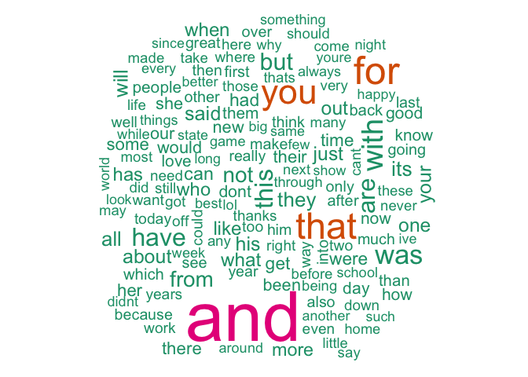
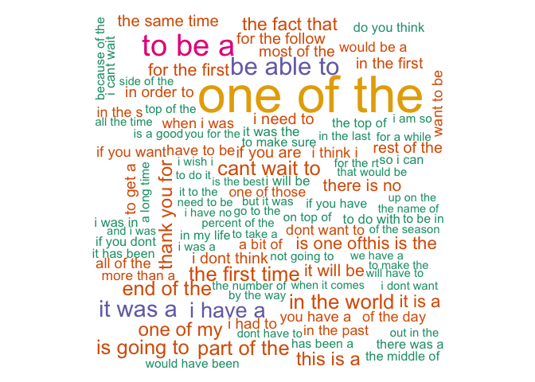
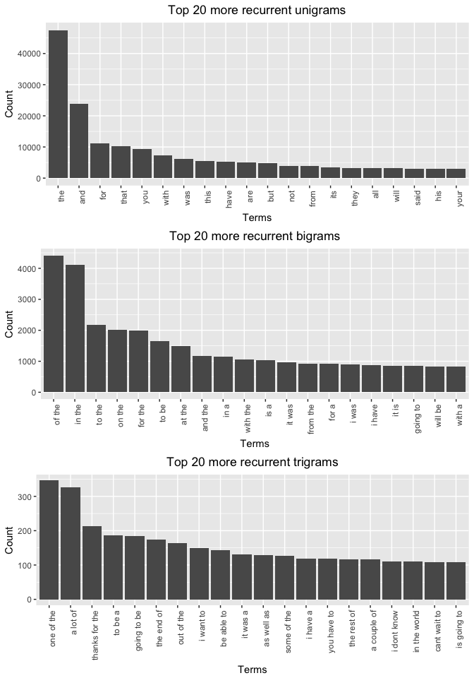
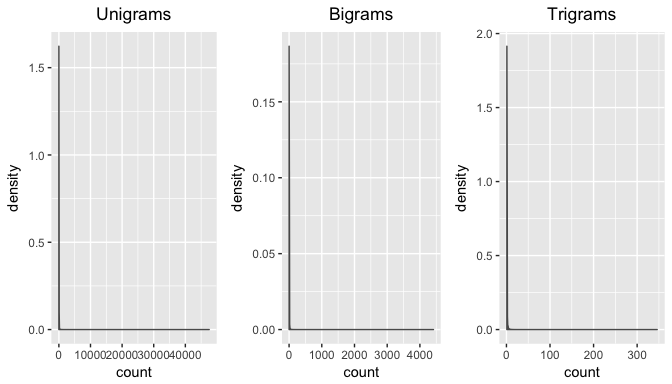

Objective
---------

The objective of this capstone project is to put in practice all
knowledge acquired during the previous 9 courses.  
The project will consist in showcasing in a shinyApp a predictive model
of the next word someone is typing on a keyboard.

Data retrieval and loading
--------------------------

Data must be downloaded from the following link:  
<https://d396qusza40orc.cloudfront.net/dsscapstone/dataset/Coursera-SwiftKey.zip>

    if(!file.exists("../Coursera-SwiftKey.zip")) {
        download.file("https://d396qusza40orc.cloudfront.net/dsscapstone/dataset/Coursera-SwiftKey.zip", 
                      "../Coursera-SwiftKey.zip", method = "curl")
        unzip("../Coursera-SwiftKey.zip")
    }

The following files are available once the archive has been unzipped:

-   final:
    -   de\_DE
    -   en\_US
    -   fi\_FI
    -   ru\_RU

Each language specific sub-folder contains three files:

-   \[**locale**\].blogs.txt
-   \[**locale**\].news.txt
-   \[**locale**\].twitter.txt

In this project, we will focus on the en\_US locale. Data can be loaded
as follow:

    US_twitter <- readLines("../final/en_US/en_US.twitter.txt", skipNul = TRUE)
    US_blogs <- readLines("../final/en_US/en_US.blogs.txt", skipNul = TRUE)
    US_news <- readLines("../final/en_US/en_US.news.txt", skipNul = TRUE)

The `skipNul` argument of the `readLines` function allows to skip NULL
lines.

Some interesting facts on these files:

<table style="width:60%;">
<colgroup>
<col width="25%" />
<col width="16%" />
<col width="18%" />
</colgroup>
<thead>
<tr class="header">
<th align="right">file_name</th>
<th align="right">file_size</th>
<th align="right">nb_of_lines</th>
</tr>
</thead>
<tbody>
<tr class="odd">
<td align="right">en_US.twitter.txt</td>
<td align="right">159.4 Mb</td>
<td align="right">2,360,148</td>
</tr>
<tr class="even">
<td align="right">en_US.blogs.txt</td>
<td align="right">200.4 Mb</td>
<td align="right">899,288</td>
</tr>
<tr class="odd">
<td align="right">en_US.news.txt</td>
<td align="right">196.3 Mb</td>
<td align="right">1,010,242</td>
</tr>
</tbody>
</table>

Exploratory analysis
--------------------

### Subsetting strategy

With a total of 4,269,678 lines, the Corpus is way to big to be used
entirely.

My strategy is to use 1% of each files:

    sub_US_twitter <- US_twitter[as.logical(rbinom(length(US_twitter), 1, .01))]
    sub_US_blogs <- US_blogs[as.logical(rbinom(length(US_blogs), 1, .01))]
    sub_US_news <- US_news[as.logical(rbinom(length(US_news), 1, .01))]

    sub_US <- c(sub_US_twitter, sub_US_blogs, sub_US_news)

Using the `tm` package, I can create a Corpus that I will later use to
apply data cleaning transformations and to create n-grams:

    library(tm)

    corpus <- VCorpus(VectorSource(sub_US))

### Data cleaning

I will apply several cleaning transformations on the data via the `td`
package:

    library(dplyr)

    swearWords <- read.csv("../swearWords.csv", header = FALSE, stringsAsFactors = FALSE)

    cleanCorpus <- tm_map(corpus, removeNumbers) %>%
        tm_map(content_transformer(function(x) gsub("(f|ht)tp(s?)://(.*)[.][a-z]+[^\\s.]+", " ", x, perl = TRUE))) %>%
        tm_map(content_transformer(function(x) gsub("[@#][^\\s]+", " ", x, perl = TRUE))) %>%
        tm_map(content_transformer(tolower)) %>%
        tm_map(content_transformer(function(x) iconv(x, "latin1", "ASCII", sub = ""))) %>%
        tm_map(removeWords, swearWords$V1) %>%
        tm_map(removePunctuation, preserve_intra_word_dashes = TRUE) %>%
        tm_map(stripWhitespace)

Other cleaning rules have been reviewed but not used:

-   stemming words: as our application comprise a generation phase
    (prediction of the next word), it would have been necessary to add
    back what was removed from the stemming process which complexity was
    not worth the gain.
-   foreign words: test of the `textcat` package showed very
    poor results. Therefore, I decided not to use it.

### Words distribution

We are now going to look at the distribution of words: uni-grams,
bi-grams and tri-grams.  
Using the `tm` package, we can create a `DocumentTermMatrix` object
which is a sparse matrix of Terms appearing in each Document.  
Using the `tidytext` package, we can manipulate the sparse matrix as a
`data.frame`.

We are first interested in the frequency of uni-grams (each Term in the
Corpus):

    library(tidytext)

    dtm_one <-DocumentTermMatrix(cleanCorpus)
        
    dtm_one_td <- tidy(dtm_one) %>%
        group_by(term) %>%
        summarise(count = sum(count)) %>%
        arrange(desc(count))

Using the `wordcloud` package, we can represent uni-grams graphically:

Then, we can calculate bi-grams using a special tokenizer during the
creation of the sparse matrix:

    options(java.parameters = "-Xmx14g")
    options(mc.cores = 1)
    library(RWeka)

    BigramTokenizer <- function(x) NGramTokenizer(x, Weka_control(min = 2, max = 2))

    dtm_two <- DocumentTermMatrix(cleanCorpus, control = list(tokenize = BigramTokenizer))
        
    dtm_two_td <- tidy(dtm_two) %>% 
        group_by(term) %>%
        summarise(count = sum(count))

    terms <- matrix(unlist(strsplit(dtm_two_td$term, " ")), ncol = 2, byrow = TRUE)

    dtm_two_td <- dtm_two_td %>%
        mutate(
            first_word = terms[, 1],
            second_word = terms[, 2]) %>% 
        arrange(desc(count))

Finally, we can calculate tri-grams:

    TrigramTokenizer <- function(x) NGramTokenizer(x, Weka_control(min = 3, max = 3))

    dtm_three <- DocumentTermMatrix(cleanCorpus, control = list(tokenize = TrigramTokenizer))
        
    dtm_three_td <- tidy(dtm_three) %>% 
        group_by(term) %>%
        summarise(count = sum(count)) 

    terms <- matrix(unlist(strsplit(dtm_three_td$term, " ")), ncol = 3, byrow = TRUE)

    dtm_three_td <- dtm_three_td %>%
        mutate(
            first_two_words = paste(terms[, 1], terms[, 2]),
            third_word = terms[, 3]) %>% 
        arrange(desc(count))

We can look at the frequency of our n-grams using bar charts:

The distribution of our n-grams is similar but the highest count
decrease when N increases:

Here is a summary of the number of observed unique n-gram compared to
the vocabulary size:

<table style="width:88%;">
<colgroup>
<col width="34%" />
<col width="13%" />
<col width="19%" />
<col width="19%" />
</colgroup>
<thead>
<tr class="header">
<th align="center"> </th>
<th align="right">unigram</th>
<th align="right">bigram</th>
<th align="right">trigram</th>
</tr>
</thead>
<tbody>
<tr class="odd">
<td align="center"><strong># of observed unique n-gram</strong></td>
<td align="right">55,735</td>
<td align="right">434,747</td>
<td align="right">759,544</td>
</tr>
<tr class="even">
<td align="center"><strong>(V, V^2, V^3)</strong></td>
<td align="right">55,735</td>
<td align="right">3,106,390,225</td>
<td align="right">1.731347e+14</td>
</tr>
<tr class="odd">
<td align="center"><strong>pourcentage</strong></td>
<td align="right">100%</td>
<td align="right">0.01399525%</td>
<td align="right">4.387013e-07%</td>
</tr>
</tbody>
</table>

V obviously corresponds to the Vocabulary size: The unique number of
uni-grams taken into account.

Coverage
--------

One of the future objective will be to find the correct balance between
accuracy and performance.  
It will therfore be necessary to truncate our dictionnary in order to
increase performance and reduce memory footprint.

Let's calculate the number words we need, in a frequency sorted
dictionary, to cover 50% of all word instances in the language? 90%?

    cumul_nb <- 0
    i <- 1

    while(cumul_nb < (.5 * sum(dtm_one_td$count))) {
        cumul_nb <- cumul_nb + dtm_one_td[i, ]$count
        i <- i + 1
    }

The number of words required to cover 50% of all word instances is
309.  
The number of instances of the word at the 50% threshold is 297.

    while(cumul_nb < (.9 * sum(dtm_one_td$count))) {
        cumul_nb <- cumul_nb + dtm_one_td[i, ]$count
        i <- i + 1
    }

The number of words required to cover 90% of all word instances is
9728.  
The number of instances of the word at the 90% threshold is 6.

In the future, we will use this method to choose the minimum number of
instances for a word to be kept in the dictionnary.

Thoughts for a prediction model
-------------------------------

I am going to create a predictive model based on a tri-gram language
model which is based on the theory of second-order Markow Processes.

As seen above the percentage of observed tri-grams in our Corpus
compared to the total number is very small: 4.387013e-07%. Meaning that
any non-observed tri-gram in the training Corpus will never be proposed
during the testing phase.  
Therefore, I am going to apply a discounting method: The Katz Back-Off
Model.

In order to evaluate the accuracy of the produced model, I think about
different strategies:

-   A measure of perplexity which will be based on the probability of
    test sentences to be produced from our model
-   A "real life" accuracy measure of 3 proposed following words: 3
    words will be proposed to the user. If one of them match then we
    count a hit. At the end, we will count hits / total.

The corpus will require to be split into a training and testing sets.
