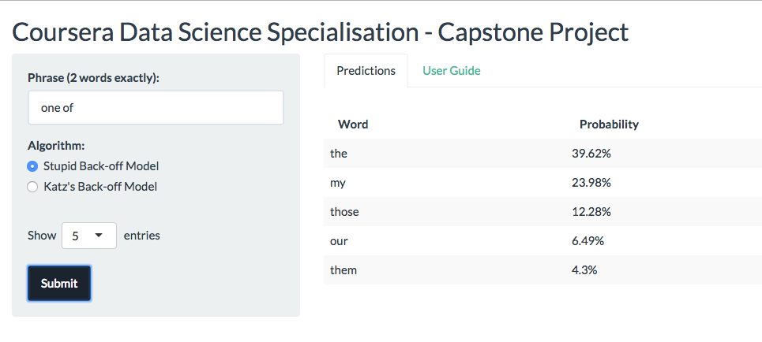
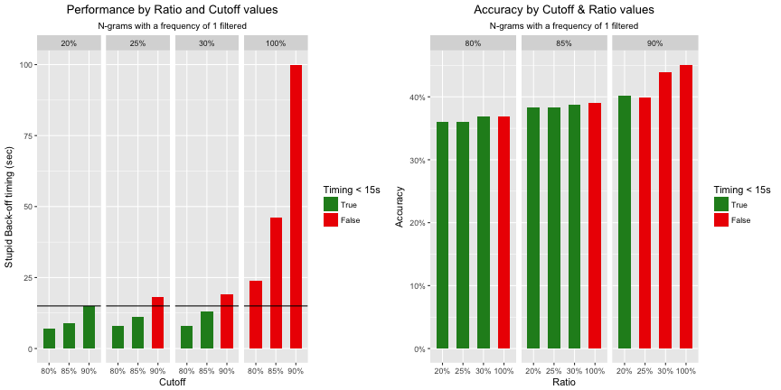

Coursera Data Science Capstone Project
========================================================
author: Sébastien Lievain
date: 16/02/2017
transition: rotate
autosize: true

The data product created during this Capstone Project aims at reproducing the well known Swiftkeys keyboard prediction feature.  

It is hosted on shinyapps.io and therefore the 1 Go constraint was taken into account when optimizing the accuracy / performance tradeoff.

 

How it works
========================================================

The data product is organised with a traditionnal two-column layout.  
The left panel holds parameters the User can interact with:
* **Phrase**: It has to be exactly two-words long or an error message will be displayed.
* **Algorithm**: The User can choose between the quick "Stupid Back-off model" or the more accurate "Katz back-off model".
* **Show X entries**: It will impact the number of displayed results.

Prediction Models
========================================================
Our prediction model is based on a Tri-grams Language Model (2^nd order Markov property).

In order to deal with unobserved tri-grams, two different models have been implemented:
- Stupid back-off: 
    * It produces good results when applied on very large N-grams tables.
    * It doesn't account for unobserved tri-grams as such but instead backs off to lower n-grams. Therefore, it is very quick.
- Katz back-off:
    * In addition to a back-off "component", it also includes a discounting method (form of smoothing) in order to estimate probabilities of unobserved tri-grams.

The Performance vs Accuracy tradeoff
========================================================
 
## Accuracy

The accuracy of the model was first calculated using Perplexity.  
Unfortunately, the result was not stable when increasing the test dataset size and therefore not interpretable.

=> I finally decided to estimate the accuracy by measuring the number of hits (among top 3 predicted words) vs total number of tests.

## Performance

Performance was obtained by timing the execution of both the Stupid and Katz back-off algorithms.

Acceptable limit artificially set to 15 seconds.

***
 
## Model Parameters

Parameters of the model used to optimize the Performance vs Accuracy tradeoff were:

* Sampling of the training set (30% or 100%)
* Filtering or not bigrams and trigrams with only 1 occurence
* Filtering words from dictonnary based on the distribution of unigrams frequency sorted descending (80%, 85% and 90%)

Results and Resources
========================================================
The optimization task led to the selection of a ratio of 20% and a cutoff of 90% with bigrams and trigrams with a frequency of one filtered out.

Link to my data product on shinyapps.io:  
https://slievain.shinyapps.io/data_science-capstone_project/

The code of the data product, reports and scripts can be found on GitHub:  
https://github.com/slievain/...

Some videos from Michael Collins of Columbia who gave an excellent class on NLP:  
https://www.youtube.com/playlist?list=PLO9y7hOkmmSH7-p6que1MYbhBx74AzH7-  
https://www.youtube.com/playlist?list=PLO9y7hOkmmSHE2v_oEUjULGg20gyb-v1u

